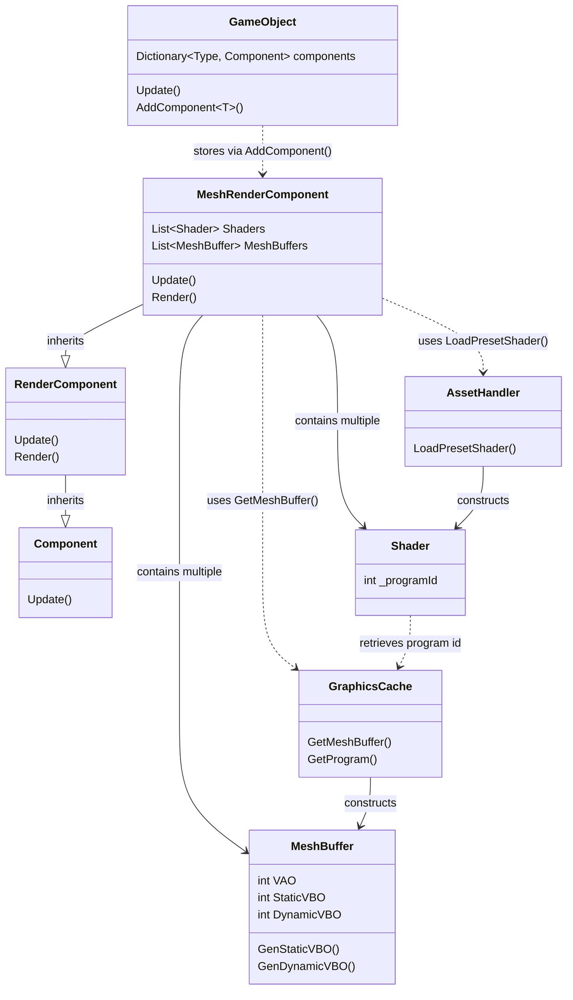

# Graphics Flow

The graphic below shows how the initialization of a new graphics object. Most things revolve around [the Graphics Cache](xref:Crux.Graphics.GraphicsCache)

```mermaid
classDiagram
    class GameObject {
         Dictionary~Type, Component~ components
         Update()
         AddComponent~T~()
    }
    class Component {
	     Update()
    }
    class RenderComponent {
	     Update()
	     Render()
    }
    class MeshRenderComponent {
	     List~Shader~ Shaders
	     List~MeshBuffer~ MeshBuffers
	     Update()
	     Render()
    }
    class GraphicsCache {
	     GetMeshBuffer()
	     GetProgram()
    }
    class AssetHandler {
	     LoadPresetShader()
    }
    class MeshBuffer {
	     int VAO
	     int StaticVBO
	     int DynamicVBO
	     GenStaticVBO()
	     GenDynamicVBO()
    }
    class Shader {
	     int _programId
    }

    GameObject ..> MeshRenderComponent : stores via AddComponent()

    MeshRenderComponent --|> RenderComponent : inherits
    RenderComponent --|> Component :  inherits

    MeshRenderComponent ..> GraphicsCache : uses GetMeshBuffer()
    MeshRenderComponent ..> AssetHandler : uses LoadPresetShader()

    MeshRenderComponent --> Shader : contains multiple
    MeshRenderComponent --> MeshBuffer : contains multiple

    AssetHandler --> Shader : constructs
    GraphicsCache --> MeshBuffer : constructs

    Shader ..> GraphicsCache : retrieves program id
```

