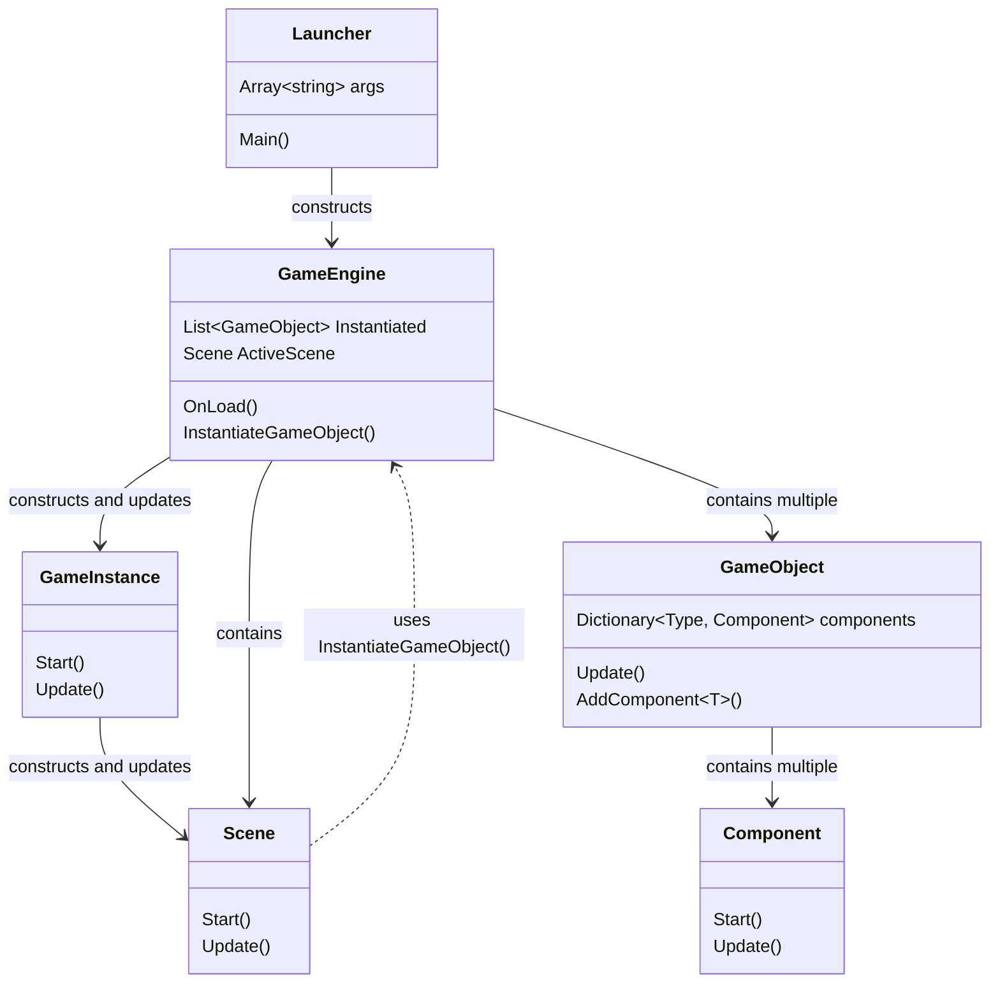

# Introduction

## Initialization

```mermaid
classDiagram
	class Launcher {
		Array~string~ args
	     Main()
    }
	class GameEngine {
		List~GameObject~ Instantiated
		Scene ActiveScene
		OnLoad()
		InstantiateGameObject()
	}
    class GameInstance {
	     Start()
	     Update()
    }
    class Scene {
	     Start()
	     Update()
    }
	class GameObject{
		Dictionary~Type, Component~ components
        Update()
        AddComponent~T~()
	}
	class Component {
		Start()
	    Update()
    }

	Launcher --> GameEngine : constructs
	GameEngine --> GameInstance : constructs and updates
	GameInstance --> Scene : constructs and updates

	Scene ..> GameEngine : uses InstantiateGameObject()
	
	GameEngine --> GameObject : contains multiple
	GameEngine --> Scene : contains
	GameObject --> Component : contains multiple
```

