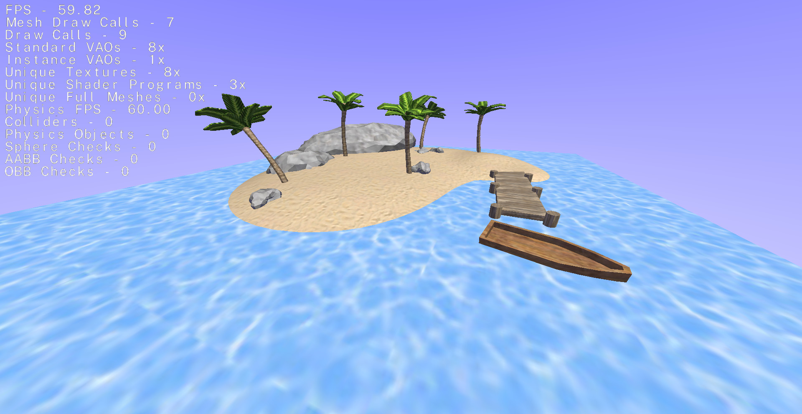

# Crux

Hobbyist 3D C# Game Engine using OpenTK



## Built With

* [.NET SDK (8.0.204)](https://dotnet.microsoft.com/en-us/download/dotnet/8.0) - C# Software Development Kit
* [OpenTK (4.8.2)](https://github.com/opentk/opentk) - C# Wrapper For OpenGL
* [StbImageSharp (2.30.15)](https://github.com/StbSharp/StbImageSharp) - C# Image Handling
* [StbImageWriteSharp (1.16.7)](https://github.com/StbSharp/StbImageWriteSharp) - C# Image Handling
* [AngleSharp (1.3.0)](https://github.com/AngleSharp/AngleSharp) - C# Angle Bracket Parser
* [AngleSharp.Css (1.0.0-beta.154)](https://github.com/AngleSharp/AngleSharp.Css) - C# Cascading Stylesheets Parser

## Set Up

First you will need to create a GameScene.cs script under Game/Assets/Scenes/ using the following template:
```
global using OpenTK.Mathematics;
global using System.Text;
global using Crux.Core;

namespace Game.Assets.Scenes;

public class GameScene : Scene
{
    public override void Start()
    {
        
    }

    public override void Update()
    {
        
    }
}
```

Next open Game/Game.cs and set the GameScene as the active scene.
```
GameEngine.Link.ActiveScene = new GameScene();
```

## Build Commands

Compile and run:
```
dotnet run --project Game -c Debug
```

Publish:
```
.\publish.bat
```

Regenerate solution:
```
dotnet new sln --name OpenTK
dotnet sln OpenTK.sln add (Get-ChildItem -Recurse *.csproj)
```

Generate and serve DocFX (auto-populate docs/toc.yml):
```
dotnet script docfx.csx
```

Generate and serve DocFX (manually):
```
docfx metadata CruxDocs/docfx.json
docfx CruxDocs/docfx.json --serve
```

For more information, visit [Crux Docs](https://jordanmillett.github.io/Crux/).

## License

This project is licensed under the MIT License - see the [LICENSE.md](LICENSE.md) file for details